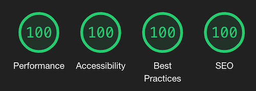

# NextBook: Create lovely documentation with MDX!

## What Is NextBook?

**Try live example [here](https://next-book.vercel.app)**

NextBook is quick and easy way to buid technical books or documentation that support modern standards and run blazingly fast. It's built with [MDX](https://mdxjs.com/), [Next.js](https://nextjs.org/) and [React](https://reactjs.org/) and works by compiling markdown or MDX down to plain static html. This way, first content render on user's device is very fast, then hydration kicks in and React takes over to add dynamic stuff. The possibilities are endless.

## Primary Features

### User Interface

- Fast and responsive UI, content should be readable and accessible on most devices.
- Good out of the box looks thanks to [Halfmoon](https://www.gethalfmoon.com/).
- Keyboard shortcuts to toggle features (sidebar, lights off, next/previous page navigation).
- Built-in light and dark mode (press <kbd>shift + R</kbd>) for pleasant reading.
- Smooth progressbar on top indicating how far on the page you are.
- Side menu that keeps reader's read progress.
- In-page dynamic table of contents (if titles are used within the document) with scroolspy.

### SEO

- SEO optimised meta tags.
- robots.txt generated at build time.
- Sitemap generated at built time.
- Great lighthouse score (100% in all fields).

### Functionality & Speed

- A pre-built, single page [JAMSTACK](https://jamstack.org/) application for fast [FCP](https://developer.mozilla.org/en-US/docs/Glossary/First_contentful_paint).
- Fast page loading and pre-loading.
- Cross-page linking with no page reloads.

### Content Creation

- Rich [markdown](https://www.markdownguide.org/) suport for content.
- For more interactivity, [MDX](https://mdxjs.com/) power is at your fingertips.
- Fenced code with metadata support allowing code titles, line numbers, links to source, clipboard copying, line highlighting.
- Need even more dynamic features? See [customization & extensibility](#customization--extensibility) below.

### Collaboration & Deployment

- You own your data, content is in plain markdown files, no proprietary formats or apps.
- Collaborate with peers and deploy via familiar GIT workflows as you're used to do with code.
- No hassle, automatic [deployment](https://vercel.com/new) with a single push.

### Customization & Extensibility

- Built on open-source. Nuff said.
- Customizable and easy to read code.
- NextBook is built on top of great and stable software like [Next.js](https://nextjs.org/), [React](https://reactjs.org/), [MDX](https://mdxjs.com/) and [remark](https://github.com/remarkjs/remark). You can leverage everything these libraries are able to offer to improve it further and suit your needs.

## Get Started

## Learn More

Check the [demo site](https://next-book.vercel.app/) for more information.
